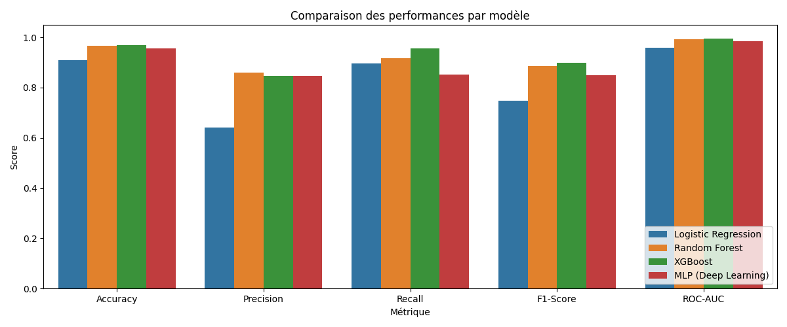
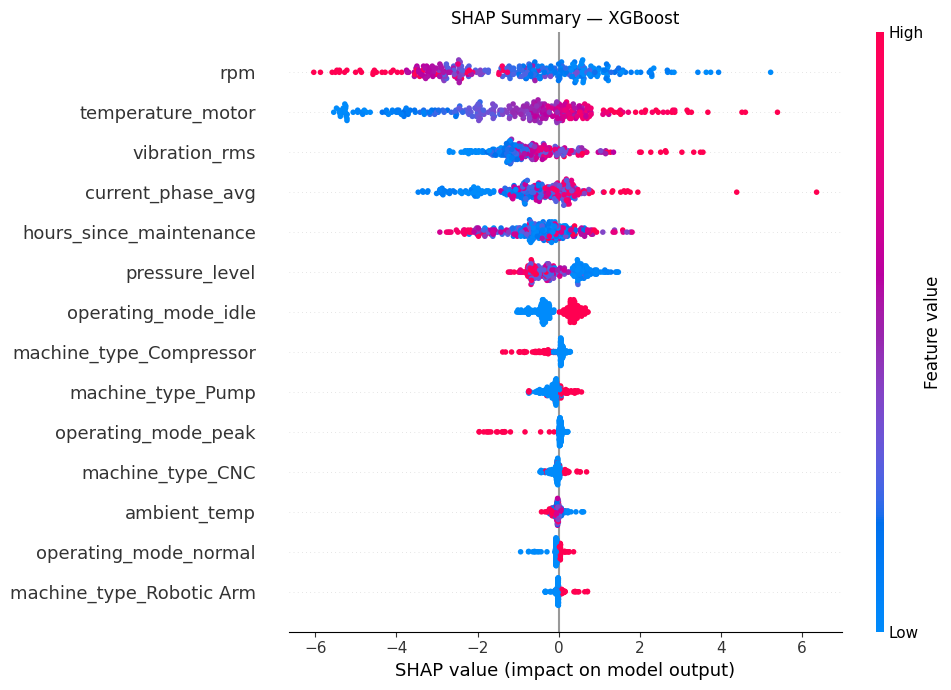

<!-- _class: cover -->

# Système Intelligent Multi-Modèles
# pour la Maintenance Prédictive Industrielle

## Projet M2 Data Science — EFREI 2025-26

*Khalil DJAHEL / Bryan BONTRAIN*

*RNCP36739 — Bloc 4*

---

## Contexte et problème

| Maintenance corrective | Maintenance prédictive |
|---|---|
| Panne survenue → réparation d'urgence | Signal capteur dégradé → intervention planifiée |
| Arrêt non planifié, coûts élevés | Coût maîtrisé, zéro surprise |
| Risque opérateur | Sécurité préservée |

**Notre approche**

Classification binaire supervisée sur la variable `failure_within_24h`.

Les capteurs industriels (vibration, température, pression, RPM) génèrent en continu des signaux porteurs de patterns annonciateurs de panne. L'objectif est de les exploiter pour détecter une défaillance 24 heures à l'avance.

---

## Dataset et pipeline

**24 042 observations — 9 features retenues — 4 types de machines**

Trois colonnes supprimées pour éviter le **data leakage** :

| Colonne supprimée | Raison |
|---|---|
| `failure_type` | Révèle directement qu'une panne est en cours |
| `rul_hours` | Encode implicitement la cible (corrélation -0.25) |
| `estimated_repair_cost` | Calculé après la panne, indisponible en temps réel |

**Pipeline sklearn (anti-leakage)**

```
Split stratifié 80/20   →   ColumnTransformer ajusté sur TRAIN uniquement
  Numériques (7)  :  Median Imputer  +  StandardScaler
  Catégorielles (2):  Mode Imputer   +  OneHotEncoder
```

Toutes les statistiques de preprocessing sont calculées sur le train set, puis appliquées sur le test set sans contamination.

---

## Les 4 modèles

| Modèle | Principe | Gestion du déséquilibre (85/15) |
|---|---|---|
| Logistic Regression | Combinaison linéaire + sigmoïde — baseline | `class_weight='balanced'` |
| Random Forest | 200 arbres indépendants, vote (bagging) | `class_weight='balanced'` |
| XGBoost | 200 arbres séquentiels, chacun corrige le précédent (boosting) | `scale_pos_weight=5.75` |
| MLP Deep Learning | 128 → 64 → 32 neurones, ReLU, backpropagation | `early_stopping=True` |

**Métriques retenues**

Le Recall est prioritaire : un faux négatif (panne non détectée) est le cas le plus coûteux industriellement. Le F1-Score équilibre Recall et Precision. L'Accuracy seule est trompeuse sur un dataset déséquilibré.

---

## Résultats

| Modèle | Recall | F1-Score | ROC-AUC |
|---|---|---|---|
| Logistic Regression | 0.895 | 0.747 | 0.959 |
| Random Forest | 0.916 | 0.887 | 0.993 |
| **XGBoost** | **0.955** | **0.898** | **0.996** |
| MLP Deep Learning | 0.853 | 0.850 | 0.984 |



Cross-validation 5-fold XGBoost : **F1 = 0.9026 ± 0.0099** — modèle stable, pas d'overfitting.

---

## Interprétabilité



**Top 5 features :** `vibration_rms` — `temperature_motor` — `hours_since_maintenance` — `rpm` — `pressure_level`

SHAP explique chaque prédiction individuelle. Une vibration élevée (valeur rouge, axe positif) augmente la probabilité de panne. Un entretien récent (valeur bleue, axe négatif) la réduit. Les décisions sont physiquement cohérentes et justifiables auprès d'un responsable maintenance.

---

## Dashboard et conclusion

**Dashboard Streamlit** — 4 onglets : EDA, comparaison des modèles, prédiction en temps réel, interprétabilité.

```
streamlit run dashboard/app.py
```

**Bilan**

XGBoost retenu : F1 = 0.898 — Recall = 0.955 — ROC-AUC = 0.996

Avec un Recall de 95.5 %, le système détecte 19 pannes sur 20 avant leur survenue, permettant de planifier des interventions préventives à moindre coût.

**Perspectives :** features temporelles (rolling mean 1 h / 6 h), ajustement du seuil de décision, monitoring de dérive, API REST FastAPI.
