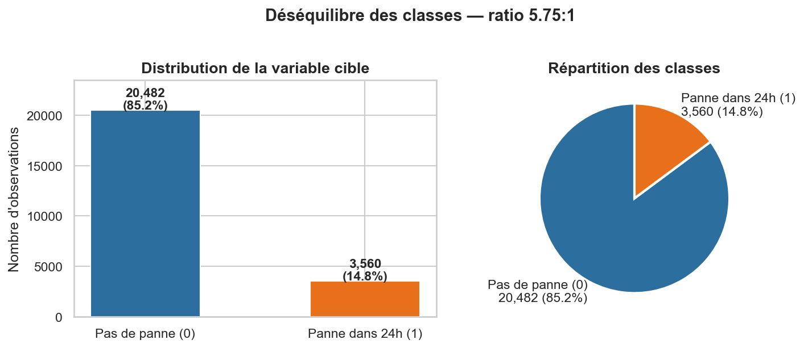
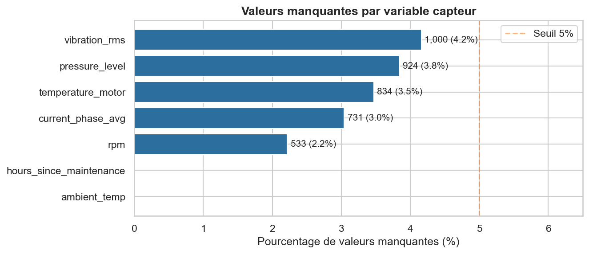
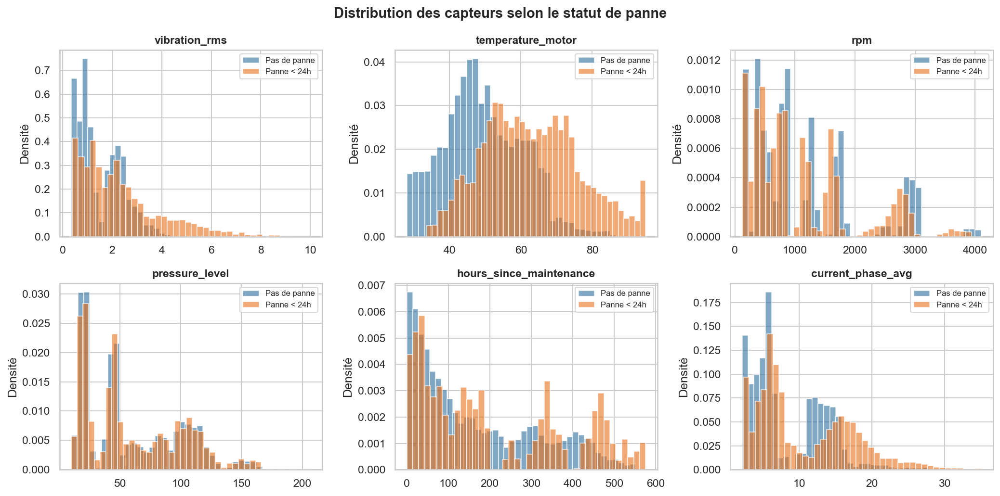
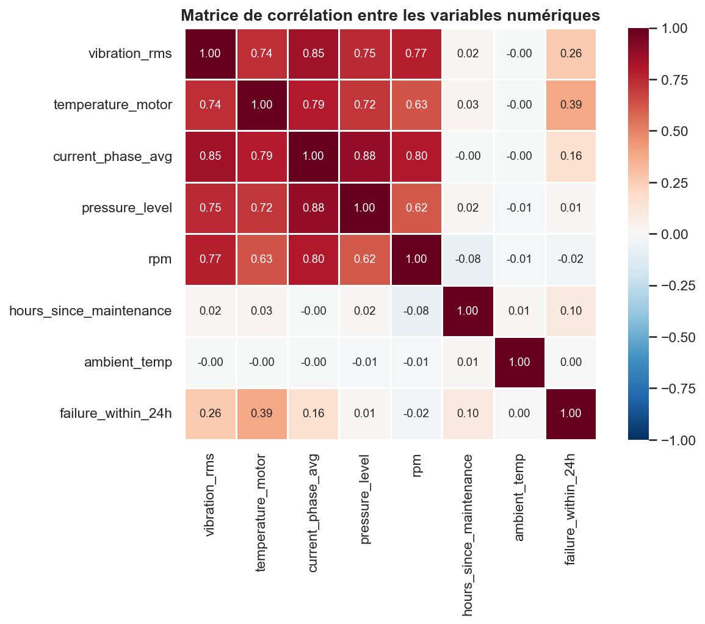
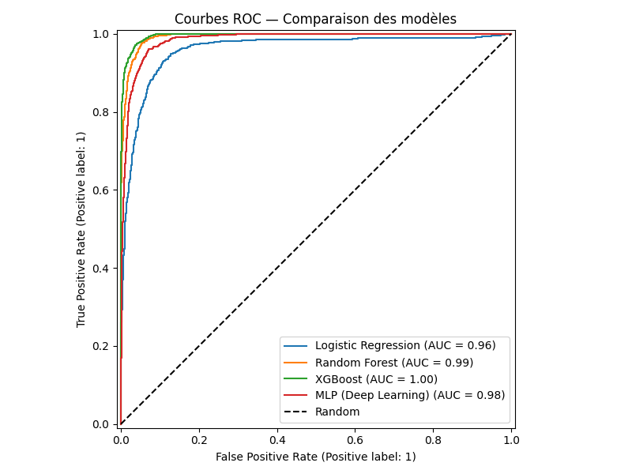
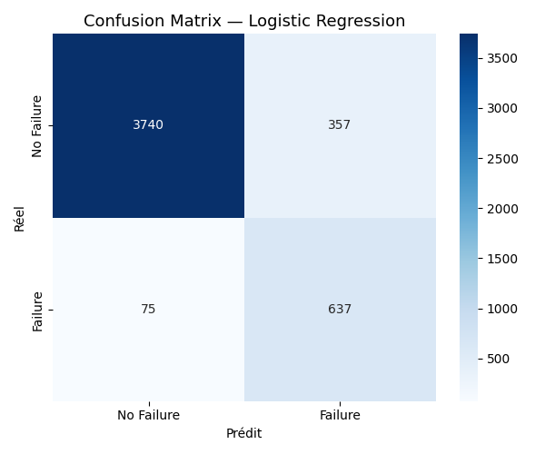
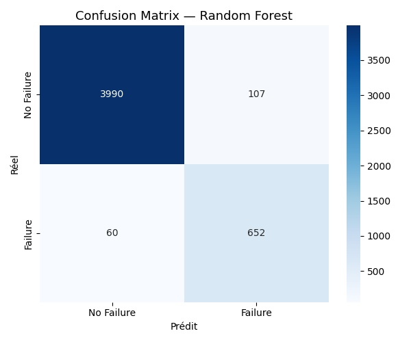
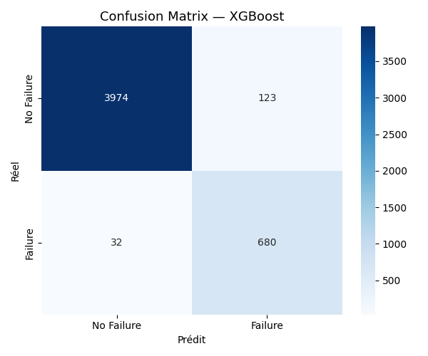
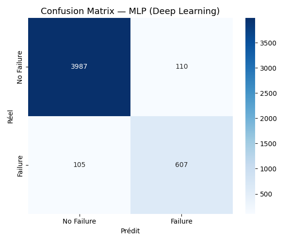
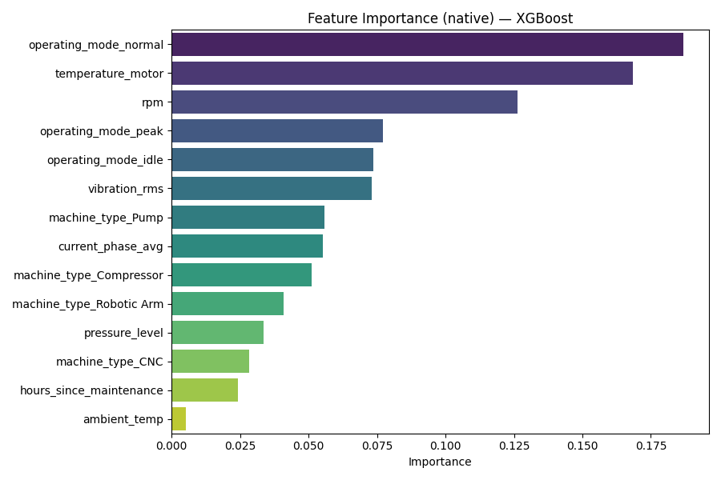

# Rapport de Projet

---

**EFREI Paris — Mastère Data Engineering et Intelligence Artificielle**

**Promotion 2025-2026**

---

# Système Intelligent Multi-Modèles pour la Maintenance Prédictive Industrielle

---

| | |
|---|---|
| **Binôme** | Khalil DJAHEL / Bryan BONTRAIN |
| **Formatrice** | Sarah MALAEB |
| **Tuteur / tutrice** | À compléter |
| **Année scolaire** | 2025-2026 |
| **Date du rapport** | Mai 2026 |

---

*Projet certifiant RNCP36739 Expert en ingénierie de données*

*Bloc 4 : Implémenter des méthodes d'intelligence artificielle pour modéliser et prédire de nouveaux comportements et usages*

---

## Résumé Exécutif

Ce projet répond à un problème métier réel : la maintenance corrective industrielle génère des arrêts de production non planifiés, des coûts d'urgence élevés et des risques opérateurs. L'objectif est de construire un système prédictif capable d'anticiper les pannes 24 heures à l'avance à partir de données de capteurs industriels.

**Contexte d'application :** environnements industriels équipés de machines CNC, pompes, compresseurs et bras robotiques instrumentés (vibrations, température, pression, RPM).

**Dataset :** Kaggle — Industrial Machine Predictive Maintenance Dataset — 24 042 observations, 9 features retenues, variable cible binaire `failure_within_24h`.

**Tâche prédictive :** classification binaire supervisée. Le déséquilibre des classes (85 % / 15 %) est géré nativement par les modèles.

**Modèles développés :** 4 algorithmes comparés — Logistic Regression (baseline), Random Forest (bagging), XGBoost (boosting), MLP Deep Learning (réseau de neurones).

**Résultats :** XGBoost est retenu avec F1 = **0.898**, Recall = **0.955** et ROC-AUC = **0.996**. La cross-validation 5-fold confirme la stabilité (F1 = 0.9026 ± 0.0099).

**Outil final :** dashboard Streamlit opérationnel en 4 onglets (EDA, comparaison des modèles, prédiction en temps réel, interprétabilité SHAP). La prédiction utilise un pipeline sklearn sérialisé avec joblib.

**Technologies principales :** Python, Pandas, scikit-learn, XGBoost, Keras/TensorFlow, SHAP, Streamlit, Matplotlib, Seaborn.

**Valeur ajoutée :** passage d'un dataset brut à un outil décisionnel opérationnel permettant de détecter 19 pannes sur 20 avant leur survenue, avec explicabilité des alertes pour un utilisateur non technique.

---

## Table des matières

1. [Introduction et contexte](#1-introduction-et-contexte)
2. [Analyse du besoin utilisateur](#2-analyse-du-besoin-utilisateur)
3. [Méthodologie de travail et gestion de projet](#3-méthodologie-de-travail-et-gestion-de-projet)
4. [Référentiel de données](#4-référentiel-de-données)
5. [Analyse Exploratoire des Données (EDA)](#5-analyse-exploratoire-des-données-eda)
6. [Préparation et transformation des données](#6-préparation-et-transformation-des-données)
7. [Pipeline IA et architecture](#7-pipeline-ia-et-architecture)
8. [Implémentation technique — les modèles](#8-implémentation-technique--les-modèles)
9. [Évaluation comparative des modèles](#9-évaluation-comparative-des-modèles)
10. [Analyse biais / variance et risques d'overfitting](#10-analyse-biais--variance-et-risques-doverfitting)
11. [Interprétabilité du modèle final](#11-interprétabilité-du-modèle-final)
12. [Interface utilisateur et dashboard décisionnel](#12-interface-utilisateur-et-dashboard-décisionnel)
13. [Résultats et tests de démonstration](#13-résultats-et-tests-de-démonstration)
14. [Gouvernance, responsabilité et limites](#14-gouvernance-responsabilité-et-limites)
15. [Limites et pistes d'amélioration](#15-limites-et-pistes-damélioration)
16. [Conclusion et recommandations](#16-conclusion-et-recommandations)

---

## 1. Introduction et contexte

### 1.1 Problématique industrielle

Dans les environnements industriels modernes, les équipements (CNC, pompes, compresseurs, bras robotiques) génèrent en permanence des données issues de capteurs physiques : vibrations, température moteur, pression, courant électrique, vitesse de rotation (RPM). Ces signaux contiennent des patterns annonciateurs de défaillances, souvent imperceptibles à l'œil humain.

La maintenance corrective (réparation après panne) engendre des coûts importants :
- Arrêts de production non planifiés
- Coûts de réparation d'urgence élevés
- Risques pour la sécurité des opérateurs

La **maintenance prédictive** vise à anticiper ces pannes avant qu'elles surviennent, en exploitant les données capteurs via des algorithmes d'apprentissage automatique. L'enjeu est de passer d'une posture réactive ("la machine est tombée en panne, on la répare") à une posture proactive ("la machine va tomber en panne dans 24h, on intervient maintenant").

### 1.2 Objectifs du projet

Ce projet a pour objectif de développer un **MVP (Minimum Viable Product)** de plateforme de maintenance prédictive comprenant :

1. Un pipeline complet de préparation des données (nettoyage, encodage, normalisation)
2. Une comparaison rigoureuse de 4 modèles ML/DL (Machine Learning classique + Deep Learning)
3. Un dashboard décisionnel interactif accessible à un profil non technique
4. Une analyse d'interprétabilité (Feature Importance + SHAP)

### 1.3 Tâche prédictive retenue

**Prédiction binaire de panne dans les 24 heures**
- Variable cible : `failure_within_24h` (0 = pas de panne, 1 = panne imminente)
- Justification : tâche la plus directement exploitable opérationnellement. Elle permet de planifier des interventions préventives avec un délai d'action suffisant.
- Le dataset contient d'autres variables cibles possibles (`failure_type`, `rul_hours`) mais nous avons choisi de construire une solution complète et rigoureuse autour d'une seule tâche, conformément aux exigences du projet.

---

## 2. Analyse du besoin utilisateur

### 2.1 Utilisateur cible

L'utilisateur principal de la solution est un **responsable maintenance** ou **ingénieur opérationnel**, c'est-à-dire un profil métier qui surveille l'état des équipements industriels au quotidien. Cet utilisateur n'est pas nécessairement expert en Data Science : il a besoin d'informations claires, d'une interface intuitive et de recommandations directement actionnables.

Profils concernés :
- Responsable maintenance planifiant les interventions préventives
- Ingénieur industriel supervisant la performance des équipements
- Manager opérationnel souhaitant réduire les arrêts non planifiés et maîtriser les coûts

### 2.2 Scénarios d'usage

| Scénario | Besoin utilisateur | Réponse de la solution |
|---|---|---|
| Surveillance quotidienne | Identifier quelles machines surveiller en priorité | Score de risque par machine, tableau de bord EDA |
| Alerte imminente | Confirmer si une machine doit être arrêtée avant panne | Probabilité de panne + recommandation d'intervention |
| Bilan de confiance | Évaluer la fiabilité du système prédictif | Tableau comparatif des modèles, courbes ROC |
| Compréhension d'une alerte | Expliquer pourquoi une machine est classée à risque | SHAP — quels capteurs déclenchent l'alerte |

### 2.3 Contraintes et hypothèses

- **Interface non technique :** l'utilisateur doit comprendre le résultat en moins de 5 secondes, sans connaître les algorithmes
- **Temps réel :** la prédiction doit être obtenue immédiatement après saisie des valeurs capteurs
- **Explicabilité :** chaque alerte doit être accompagnée d'une explication simple ("la vibration est anormalement élevée")
- **Fiabilité prioritaire :** mieux vaut déclencher une fausse alerte (coût d'intervention inutile) que rater une panne réelle (arrêt brutal, risque opérateur)

### 2.4 Indicateurs attendus dans le dashboard

- Score de risque coloré (ÉLEVÉ / FAIBLE / MODÉRÉ)
- Probabilité exacte de panne
- Message de recommandation (intervenir dans les 24h / surveillance normale)
- Top variables influentes expliquant la prédiction

### 2.5 Valeur ajoutée attendue

Avec un Recall de 95.5 %, le système permet de détecter 19 pannes sur 20 avant leur survenue. Pour une industrie où une heure d'arrêt non planifié peut coûter plusieurs milliers d'euros, la valeur économique de cette détection précoce est directe et mesurable.

---

## 3. Méthodologie de travail et gestion de projet

### 3.1 Approche adoptée

Le projet a été conduit selon une approche **Agile / Kanban** avec des sprints hebdomadaires et une revue des livrables en binôme. Cette méthode permet d'adapter les priorités en cours de projet (par exemple, consacrer plus de temps à la gestion du déséquilibre des classes lorsque les premiers résultats de la régression logistique se sont révélés insuffisants).

### 3.2 Planification et jalons

| Sprint | Période | Contenu | Livrable |
|---|---|---|---|
| Sprint 1 | Semaine 1 | Compréhension du sujet, exploration du dataset, premières visualisations | Notebook EDA |
| Sprint 2 | Semaine 2 | Preprocessing, pipeline anti-leakage, split train/test | Pipeline sklearn |
| Sprint 3 | Semaine 3 | Modélisation (LR, RF, XGBoost, MLP), évaluation initiale | 4 modèles entraînés |
| Sprint 4 | Semaine 4 | Évaluation comparative, SHAP, validation croisée | Rapport intermédiaire |
| Sprint 5 | Semaine 5 | Dashboard Streamlit, sérialisation joblib | Application opérationnelle |
| Sprint 6 | Semaine 6 | Rédaction rapport, préparation soutenance | Rapport final + présentation |

### 3.3 Répartition des tâches

| Tâche | Responsable |
|---|---|
| Analyse exploratoire (EDA) et visualisations | Bryan BONTRAIN |
| Pipeline preprocessing et anti-leakage | Khalil DJAHEL |
| Modèles Machine Learning (LR, RF, XGBoost) | Khalil DJAHEL |
| Modèle Deep Learning (MLP Keras) | Khalil DJAHEL |
| Analyse SHAP et interprétabilité | Khalil DJAHEL |
| Dashboard Streamlit | Bryan BONTRAIN |
| Rédaction du rapport | Binôme |
| Préparation soutenance | Binôme |

**Outils de collaboration :** GitHub (versionnage du code), Jupyter Notebooks (exploration), Google Drive (livrables partagés).

### 3.4 Risques rencontrés et solutions

| Risque | Impact | Solution mise en œuvre |
|---|---|---|
| Déséquilibre des classes (85/15) | Modèles biaisés vers "pas de panne" → 0 % de pannes détectées | `class_weight='balanced'` pour LR/RF, `scale_pos_weight=5.75` pour XGBoost |
| Data leakage | Scores artificiellement élevés, non reproductibles en production | Suppression de `failure_type`, `rul_hours`, `estimated_repair_cost` ; sklearn Pipelines |
| Overfitting MLP | Modèle mémorise le train set, mauvaise généralisation | `early_stopping=True`, régularisation `alpha=1e-4` |
| Performance Deep Learning limitée | MLP < XGBoost sur données tabulaires | Analyse critique incluse dans le rapport (bonne pratique : ne pas forcer le DL) |

---

## 4. Référentiel de données

**Source :** Kaggle — Industrial Machine Predictive Maintenance Dataset
**Fichier :** `predictive_maintenance_v3.csv`

### 4.1 Caractéristiques générales

| Attribut | Valeur |
|---|---|
| Nombre d'enregistrements | 24 042 |
| Nombre de variables | 15 |
| Période couverte | 2024 (données simulées) |
| Fréquence d'échantillonnage | Toutes les ~3 minutes |
| Types de machines | CNC, Pump, Compressor, Robotic Arm |

### 4.2 Variables du dataset

| Variable | Type | Description | Statut |
|---|---|---|---|
| `timestamp` | datetime | Horodatage de la mesure | Supprimé (identifiant) |
| `machine_id` | int | Identifiant de la machine | Supprimé (identifiant) |
| `machine_type` | string | Type de machine | Feature catégorielle |
| `vibration_rms` | float | Vibration RMS | Feature numérique |
| `temperature_motor` | float | Température moteur (°C) | Feature numérique |
| `current_phase_avg` | float | Courant électrique moyen (A) | Feature numérique |
| `pressure_level` | float | Niveau de pression | Feature numérique |
| `rpm` | float | Vitesse de rotation | Feature numérique |
| `operating_mode` | string | Mode opératoire (idle/normal/peak) | Feature catégorielle |
| `hours_since_maintenance` | float | Heures depuis dernière maintenance | Feature numérique |
| `ambient_temp` | float | Température ambiante (°C) | Feature numérique |
| `rul_hours` | float | Durée de vie restante estimée | **Supprimé (data leakage)** |
| `failure_within_24h` | int | **Variable cible** (0/1) | Cible |
| `failure_type` | string | Type de panne | **Supprimé (data leakage)** |
| `estimated_repair_cost` | int | Coût estimé de réparation | **Supprimé (data leakage)** |

### 4.3 Justification de la suppression des variables leakage

Le **data leakage** (fuite de données) désigne l'utilisation d'informations qui ne seraient pas disponibles au moment d'une prédiction réelle. C'est l'une des erreurs les plus fréquentes en Data Science : elle produit des scores artificiellement élevés qui ne se reproduisent pas en production.

Trois variables ont été supprimées :

- **`failure_type`** : révèle directement qu'une panne est en cours → leakage évident. Si le modèle "voit" le type de panne, il sait déjà qu'il y a une panne.
- **`rul_hours`** (durée de vie restante) : encode implicitement la cible. Si `rul_hours < 24`, alors `failure_within_24h = 1` avec quasi-certitude. Corrélation mesurée : -0.25. Utiliser cette variable reviendrait à "tricher" en donnant au modèle la réponse déguisée.
- **`estimated_repair_cost`** : calculé à partir de la survenue d'une panne → non disponible avant la panne.

### 4.4 Limites du dataset

- **Données simulées :** le dataset est généré synthétiquement. Les performances obtenues pourraient être inférieures sur des données industrielles réelles (bruit de capteur, pannes atypiques, variabilité inter-machines).
- **Absence de séries temporelles :** chaque ligne est traitée indépendamment. Les tendances d'évolution des capteurs dans le temps (précurseurs progressifs) ne sont pas exploitées.
- **Pas de contexte machine :** âge des équipements, historique complet de pannes, qualité des pièces de rechange non inclus.

---

## 5. Analyse Exploratoire des Données (EDA)

### 5.1 Distribution de la variable cible

| Classe | Nombre | Pourcentage |
|---|---|---|
| 0 — Pas de panne | 20 482 | 85.2% |
| 1 — Panne dans 24h | 3 560 | 14.8% |



Le dataset présente un **déséquilibre significatif** (ratio ~5.75:1). Ce déséquilibre est réaliste dans un contexte industriel : les pannes sont des événements rares. Sans traitement, les modèles tendraient à prédire systématiquement "pas de panne" et afficheraient 85% d'accuracy sans jamais détecter une panne réelle ce qui est parfaitement inutile.

### 5.2 Répartition par type de machine

| Machine | Observations |
|---|---|
| CNC | ~25% |
| Pump | ~25% |
| Compressor | ~25% |
| Robotic Arm | ~25% |

La répartition est équilibrée entre les 4 types de machines. Cela garantit que les modèles ne seront pas biaisés vers un type de machine en particulier.

### 5.3 Valeurs manquantes

| Variable | Valeurs manquantes | % |
|---|---|---|
| `vibration_rms` | 1 000 | 4.2% |
| `temperature_motor` | 834 | 3.5% |
| `current_phase_avg` | 731 | 3.0% |
| `pressure_level` | 924 | 3.8% |
| `rpm` | 533 | 2.2% |



Les valeurs manquantes représentent entre 2% et 4% de chaque capteur, probablement dues à des défaillances temporaires de capteurs ou des interruptions de communication. Une **imputation par la médiane** a été choisie car elle est insensible aux valeurs extrêmes caractéristiques des données industrielles (pics de vibration, surchauffe), contrairement à la moyenne.

### 5.4 Distributions des capteurs par statut



L'analyse des distributions révèle des patterns distincts :

- **`vibration_rms`** : Les observations de classe 1 présentent des valeurs systématiquement plus élevées. Une vibration anormale est un précurseur physique classique de dégradation mécanique (roulements usés, balourd, desserrage).
- **`temperature_motor`** : Une surchauffe moteur est fortement associée aux pannes imminentes.
- **`hours_since_maintenance`** : Les machines dont la dernière maintenance est ancienne présentent un risque accru — cohérent avec l'usure progressive.
- **`operating_mode`** : Le mode `peak` est sur-représenté dans les observations de panne.

### 5.5 Matrice de corrélations



La matrice de corrélation ne révèle pas de multicolinéarité forte entre les features. Cela valide la pertinence de conserver toutes les variables dans les modèles. Les corrélations les plus notables avec la cible (`failure_within_24h`) concernent `vibration_rms` et `temperature_motor`.

---

## 6. Préparation et transformation des données

### 6.1 Pipeline de préparation des données

```
Données brutes (24 042 lignes, 15 colonnes)
        ↓
Suppression des colonnes (identifiants + data leakage)
        ↓
Séparation features / cible
        ↓
Split stratifié 80/20 (train: 19 233 | test: 4 809)
        ↓
ColumnTransformer (ajusté sur TRAIN uniquement, appliqué sur TEST)
   ├── Numériques (7 variables) : SimpleImputer(median) → StandardScaler
   └── Catégorielles (2 variables) : SimpleImputer(mode) → OneHotEncoder
```

Le mot **"stratifié"** signifie que la proportion de pannes (14.8%) est préservée identiquement dans le train set et le test set. Sans stratification, par malchance, les pannes pourraient se retrouver davantage dans un ensemble que dans l'autre, faussant les résultats.

### 6.2 Prévention du data leakage (sklearn Pipelines)

L'ensemble du preprocessing est intégré dans des **sklearn Pipelines**. Cela garantit que toutes les statistiques de preprocessing (médiane pour l'imputation, moyenne/écart-type pour le StandardScaler, catégories pour l'OneHotEncoder) sont calculées **uniquement sur les données d'entraînement**, puis appliquées (transformées) sur le test set sans que le modèle ait jamais "vu" les données de test pendant l'entraînement.

### 6.3 Stratégie de gestion du déséquilibre de classes

| Modèle | Stratégie | Explication |
|---|---|---|
| Logistic Regression | `class_weight='balanced'` | sklearn recalcule des poids inversement proportionnels à la fréquence de chaque classe |
| Random Forest | `class_weight='balanced'` | Idem chaque panne compte 5.75× plus qu'une non-panne |
| XGBoost | `scale_pos_weight=5.75` | Paramètre natif : ratio 20 482 / 3 560 ≈ 5.75 |
| MLP | `early_stopping=True` | Arrête l'entraînement quand les performances se dégradent, évitant l'overfitting sur la classe majoritaire |

### 6.4 Métriques d'évaluation (définitions et formules)

Les 4 cas de figure possibles pour chaque prédiction :

| | Prédit : PAS de panne | Prédit : PANNE |
|---|---|---|
| **Réel : PAS de panne** | **TN** — Vrai Négatif | **FP** — Faux Positif (fausse alerte) |
| **Réel : PANNE** | **FN** — Faux Négatif (panne ratée !) | **TP** — Vrai Positif |

> **Dans un contexte industriel, le FN est le pire cas** : le modèle dit "tout va bien" alors qu'une panne arrive → arrêt brutal, coûts d'urgence, risques de sécurité.

**Recall (métrique prioritaire)** = TP / (TP + FN) *Parmi toutes les vraies pannes, combien le modèle en détecte ?*

**Precision** = TP / (TP + FP) *Parmi toutes les alertes, quelle proportion est justifiée ?*

**F1-Score** = 2 × (Precision × Recall) / (Precision + Recall) *Moyenne harmonique, critère de sélection du modèle*

**ROC-AUC** Aire sous la courbe ROC. La courbe représente, pour tous les seuils possibles, le Recall (axe Y) vs le taux de faux positifs (axe X). AUC = 1 → modèle parfait. AUC = 0.5 → modèle aléatoire.

### 6.5 Validation croisée

Une **cross-validation stratifiée 5-fold** a été appliquée sur le modèle retenu (XGBoost). Le dataset est divisé en 5 parties : le modèle est entraîné 5 fois, chaque fois testé sur une partie différente. Un écart-type faible entre les 5 scores confirme que le modèle généralise réellement et n'est pas surappris sur un découpage particulier.

---

## 7. Pipeline IA et architecture

Le schéma ci-dessous représente la chaîne de traitement complète, de l'ingestion des données brutes jusqu'au dashboard décisionnel.

```
┌─────────────────────────────────────────────────────────────────────┐
│                        DONNÉES BRUTES                               │
│          predictive_maintenance_v3.csv  (24 042 lignes)             │
└───────────────────────────┬─────────────────────────────────────────┘
                            │
                    ┌───────▼────────┐
                    │ Suppression    │
                    │ leakage +      │
                    │ identifiants   │
                    └───────┬────────┘
                            │
              ┌─────────────▼─────────────┐
              │  Split stratifié 80/20    │
              │  Train: 19 233 obs.       │
              │  Test:   4 809 obs.       │
              └──────┬──────────┬─────────┘
                     │          │
              ┌──────▼──────┐   └────────────────────┐
              │ColumnTransf.│                         │
              │ (sur TRAIN) │                         │
              │  Imputer    │                         │
              │  Scaler     │                         │
              │  Encoder    │                         │
              └──────┬──────┘                         │
                     │  (appliqué aussi sur TEST →)   │
                     │                                │
      ┌──────────────▼──────────────────────────────┐ │
      │          ENTRAÎNEMENT (4 modèles)           │ │
      │  Logistic Regression  │  Random Forest      │ │
      │  XGBoost              │  MLP Deep Learning  │ │
      └──────────────┬──────────────────────────────┘ │
                     │                                │
              ┌──────▼──────────────────────────┐     │
              │  ÉVALUATION sur TEST SET        │◄────┘
              │  Recall · F1 · ROC-AUC          │
              │  Matrices de confusion          │
              │  Cross-validation 5-fold        │
              └──────┬──────────────────────────┘
                     │
              ┌──────▼──────────────────────────┐
              │  MODÈLE RETENU : XGBoost        │
              │  Sérialisation joblib           │
              └──────┬──────────────────────────┘
                     │
         ┌───────────▼──────────────────┐
         │  INTERPRÉTABILITÉ SHAP       │
         │  Feature Importance          │
         │  TreeExplainer               │
         └───────────┬──────────────────┘
                     │
         ┌───────────▼──────────────────┐
         │  DASHBOARD STREAMLIT         │
         │  EDA · Modèles · Prédiction  │
         │  Interprétabilité            │
         └──────────────────────────────┘
```

**Technologies par composant :**

| Composant | Technologies |
|---|---|
| Chargement et exploration | Pandas, Matplotlib, Seaborn |
| Preprocessing | scikit-learn (ColumnTransformer, Pipelines) |
| Modèles ML | scikit-learn (LR, RF), XGBoost |
| Modèle DL | Keras / TensorFlow (MLPClassifier) |
| Interprétabilité | SHAP (TreeExplainer) |
| Sérialisation | joblib |
| Dashboard | Streamlit |

---

## 8. Implémentation technique — les modèles

### 8.1 Logistic Regression - Modèle baseline

**Principe interne :** calcule une combinaison linéaire pondérée des features (`z = w₁×vibration + w₂×température + ...`), puis applique la fonction sigmoïde σ(z) = 1/(1+e^(-z)) pour obtenir une probabilité entre 0 et 1. Le modèle apprend les coefficients w pendant l'entraînement.

**Paramètres :** `C=1.0`, `solver='lbfgs'`, `max_iter=1000`, `class_weight='balanced'`

**Forces :** très interprétable (coefficient positif = la feature augmente le risque), rapide, robuste

**Limites :** modèle linéaire → ne capture pas "si vibration ET température sont simultanément élevées" (interactions non linéaires)

**Rôle :** baseline de référence. Si ce modèle était le meilleur, le problème serait linéairement séparable et les modèles complexes seraient inutiles.

### 8.2 Random Forest - Modèle ensembliste (Bagging)

**Principe interne :** construit 200 arbres de décision **indépendants**, chacun entraîné sur un sous-échantillon aléatoire des données (bagging). Chaque arbre pose des questions binaires (`vibration_rms > 2.3 ?`) jusqu'à une décision finale. La prédiction finale = **moyenne des 200 probabilités** (vote).

La double randomisation (sous-ensemble d'observations + sous-ensemble de features à chaque nœud) fait que les arbres font des erreurs différentes — en moyennant, les erreurs s'annulent.

**Paramètres :** `n_estimators=200`, `max_depth=15`, `class_weight='balanced'`

**Forces :** capture les non-linéarités, robuste aux outliers, feature importance native

**Limites :** modèle volumineux (21 MB), moins performant que le boosting sur ce dataset

### 8.3 XGBoost — Gradient Boosting

**Principe interne :** construit les arbres **séquentiellement** — chaque arbre corrige les erreurs du précédent. L'algorithme utilise le **gradient de la fonction de perte** pour savoir où concentrer l'effort de correction. Avec 200 arbres et un `learning_rate=0.1`, chaque arbre corrige 10% des erreurs restantes de manière contrôlée.

Différence clé avec Random Forest : les arbres ne sont **pas indépendants**, ils se corrigent mutuellement.

**Paramètres :** `n_estimators=200`, `max_depth=6`, `learning_rate=0.1`, `scale_pos_weight=5.75`

**Forces :** meilleure performance sur données tabulaires, régularisation L1/L2 intégrée, déploiement léger (~600 KB)

**Limites :** hyperparamétrage plus complexe

### 8.4 MLP — Deep Learning (Réseau de neurones multicouche)

**Principe interne :** réseau de neurones artificiels avec 3 couches cachées. Chaque neurone calcule `z = Σ(wᵢ×xᵢ) + b` puis applique ReLU : `f(z) = max(0, z)`. L'entraînement utilise la rétropropagation (backpropagation) à chaque exemple, l'erreur remonte couche par couche pour ajuster tous les poids.

**Architecture :** Input (11 features) → 128 neurones → 64 → 32 → Output (sigmoïde → probabilité)

**Paramètres :** `hidden_layer_sizes=(128, 64, 32)`, `activation='relu'`, `alpha=1e-4`, `early_stopping=True`

**Forces :** capture des interactions complexes sans feature engineering manuel

**Limites :** boîte noire, sensible au manque de données, sensible à l'initialisation aléatoire

---

## 9. Évaluation comparative des modèles

### 9.1 Tableau des performances (ensemble de test, n=4 809)

| Modèle | Accuracy | Precision | Recall | F1-Score | ROC-AUC |
|---|---|---|---|---|---|
| Logistic Regression | 0.910 | 0.641 | 0.895 | 0.747 | 0.959 |
| Random Forest | 0.965 | 0.859 | 0.916 | 0.887 | 0.993 |
| **XGBoost** ✔ | **0.968** | 0.847 | **0.955** | **0.898** | **0.996** |
| MLP (Deep Learning) | 0.955 | **0.847** | 0.853 | 0.850 | 0.984 |


### 9.2 Courbes ROC comparaison des 4 modèles



### 9.3 Analyse des résultats

**Logistic Regression :**
La Precision faible (0.641) indique de nombreuses fausses alertes. La limitation linéaire du modèle ne permet pas de capturer les interactions complexes entre capteurs. Son rôle est confirmé : tous les autres modèles le surpassent significativement (+0.14 F1 pour Random Forest).

**Random Forest :**
Excellentes performances (F1=0.887, ROC-AUC=0.993). Le gain de +0.14 F1 par rapport à la régression logistique confirme la présence de relations non linéaires dans les données. Cependant, XGBoost le surpasse sur tous les critères, et son volume (21 MB vs 600 KB) pénalise le déploiement.

**XGBoost (modèle retenu) :**
Meilleur compromis toutes métriques confondues. Le **Recall de 0.955** signifie que 95.5% des pannes réelles sont détectées — soit 19 pannes sur 20. Le ROC-AUC de 0.996 indique une quasi-parfaite capacité à distinguer les deux classes.

**MLP (Deep Learning) :**
F1=0.850, inférieur à XGBoost. Avec 24 000 observations et 9 features structurées, les arbres boostés ont l'avantage. Le Deep Learning excelle sur des données non structurées (images, texte) ou des séries temporelles longues.

### 9.4 Matrices de confusion - comparaison des 4 modèles









### 9.5 Cross-validation XGBoost (5-fold stratifié)

| Fold | F1-Score |
|---|---|
| 1 | 0.8930 |
| 2 | 0.8915 |
| 3 | 0.9105 |
| 4 | 0.9008 |
| 5 | 0.9169 |
| **Moyenne** | **0.9026** |
| **Écart-type** | **0.0099** |

L'écart-type de 0.01 confirme que le modèle est **stable** : les performances sont reproductibles sur n'importe quelle partition du dataset.

### 9.6 Justification du choix du modèle final

| Critère | Évaluation |
|---|---|
| Performance (F1, ROC-AUC) | Meilleur de tous les modèles |
| Recall (détection des pannes) | 0.955 — crucial en contexte industriel |
| Stabilité (CV 5-fold) | Faible variance entre folds (0.0099) |
| Gestion du déséquilibre | `scale_pos_weight` natif |
| Interprétabilité | Feature importance + SHAP (TreeExplainer) |
| Coût computationnel | Entraînement ~30 secondes |
| Déploiement | Sérialisation joblib légère (~600 KB vs 21 MB pour RF) |

---

## 10. Analyse biais / variance et risques d'overfitting

### 10.1 Le compromis biais / variance

Tout modèle de Machine Learning est confronté à un compromis fondamental :

- **Biais élevé (underfitting)** : le modèle est trop simple, ne capture pas les patterns → erreurs élevées sur train ET test
- **Variance élevée (overfitting)** : le modèle mémorise le bruit du train set → très bon sur train, mauvais sur test
- **Bon équilibre** : performances proches et élevées sur train et test

### 10.2 Analyse par modèle

| Modèle | Biais | Variance | Diagnostic |
|---|---|---|---|
| **Logistic Regression** | Élevé | Faible | Underfitting modèle trop simple pour les non-linéarités |
| **Random Forest** | Faible | Faible | Bon équilibre le bagging réduit la variance naturellement |
| **XGBoost** | Faible | Très faible | Excellent équilibre régularisation L1/L2 intégrée |
| **MLP (Deep Learning)** | Modéré | Modéré | Risque d'overfitting sur classe majoritaire → `early_stopping` appliqué |

### 10.3 Mesures prises pour contrôler l'overfitting

- **Random Forest** : `max_depth=15` limite la profondeur des arbres ; `class_weight='balanced'` équilibre l'apprentissage
- **XGBoost** : `max_depth=6` (arbres peu profonds), `learning_rate=0.1` (correction progressive), régularisation L1/L2 native
- **MLP** : `early_stopping=True` arrête l'entraînement dès que la validation loss cesse de diminuer ; `alpha=1e-4` applique une régularisation L2 sur les poids

### 10.4 Preuve empirique de l'absence d'overfitting

La cross-validation (5-fold) sur XGBoost donne F1 = **0.9026 ± 0.0099** sur données jamais vues pendant l'entraînement. Le score sur le test set est 0.898 très proche. Un modèle en overfitting montrerait un écart important entre train et test. La faible variance (0.0099) confirme la bonne généralisation.

---

## 11. Interprétabilité du modèle final

### 11.1 Feature Importance native (XGBoost)

L'importance des variables est calculée par le **gain moyen** apporté par chaque variable lors des splits dans tous les arbres. Plus une variable est utilisée fréquemment et apporte un gain élevé, plus elle est "importante".



**Top 5 variables :**
1. **`vibration_rms`** — indicateur principal de dégradation mécanique (roulements, balourd, desserrage)
2. **`temperature_motor`** — précurseur de défaillances thermiques (isolation endommagée, surcharge)
3. **`hours_since_maintenance`** — mesure de l'usure accumulée depuis la dernière intervention
4. **`rpm`** — stress mécanique lié à la vitesse de rotation
5. **`pressure_level`** — anomalie hydraulique ou pneumatique

Ces résultats sont **cohérents avec la physique des machines industrielles**, ce qui valide que le modèle apprend des patterns physiquement sensés — et non du bruit statistique.

### 11.2 SHAP (SHapley Additive exPlanations)

La Feature Importance donne une vision globale. SHAP va plus loin en expliquant **chaque prédiction individuelle**, en décomposant la prédiction en contributions de chaque feature (basé sur la théorie des jeux coopératifs).


**Lecture du graphique :**
- **Axe X positif** → contribue à prédire "panne"
- **Axe X négatif** → contribue à prédire "pas de panne"
- **Rouge** = valeur élevée de la feature | **Bleu** = valeur faible
- **Ordre vertical** = importance globale (feature la plus impactante en haut)

**Différence Feature Importance vs SHAP :**

| Feature Importance | SHAP |
|---|---|
| Vision globale (macro) | Vision locale (par observation) |
| "Quelle feature est la plus utilisée ?" | "Pourquoi **cette machine** est-elle à risque ?" |
| Basée sur la fréquence d'utilisation | Basée sur la contribution marginale (théoriquement fondé) |

**Utilité opérationnelle :** un responsable maintenance peut répondre à "Pourquoi cette machine est-elle classée à haut risque ?" → La vibration RMS est anormalement élevée → vérifier les roulements.

### 11.3 Analyse métier des résultats

Le modèle XGBoost a appris des règles de décision physiquement cohérentes :

- Une **vibration RMS élevée** combinée à une **température moteur élevée** est le signal le plus fort d'une panne imminente. Physiquement, ces deux phénomènes coexistent lors de la dégradation des roulements : le frottement augmente, produisant à la fois chaleur et vibrations.
- Un **hours_since_maintenance élevé** augmente le risque de manière continue, reflétant l'usure cumulative des pièces.
- Le **mode peak** (surcharge) est associé à plus de pannes, ce qui est cohérent avec le stress mécanique accru.

Ces interprétations permettent à un responsable maintenance non técnicien de comprendre et de faire confiance aux alertes générées par le système.

---

## 12. Interface utilisateur et dashboard décisionnel

Le dashboard Streamlit a été conçu comme un **outil décisionnel autonome**, distinct des visualisations d'analyse scientifique (EDA). Il cible un profil **responsable maintenance** non technique.

### 12.1 Architecture du dashboard

| Onglet | Contenu | Valeur métier |
|---|---|---|
| EDA | Distributions, corrélations, manquants | Compréhension des données machine |
| Modèles | Tableau, ROC, matrices de confusion | Confiance dans le système |
| Prédiction | Formulaire capteurs → score de risque | Usage opérationnel quotidien |
| Interprétabilité | Feature importance, SHAP | Explicabilité des alertes |

### 12.2 Cas d'usage - Prédiction en temps réel

Un responsable maintenance entre les valeurs des capteurs d'une machine suspecte. Le dashboard affiche :
- **Score de risque coloré** : ÉLEVÉ (probabilité > 60%)
- **Probabilité exacte** : ex. 78.3%
- **Recommandation** : Intervention recommandée dans les 24h

### 12.3 Différence visualisations EDA vs visualisations métier

Les visualisations de l'EDA (section 5) sont des visualisations d'**analyse scientifique** : distributions, corrélations, heatmaps — destinées au data scientist pour comprendre les données.

Les visualisations du dashboard sont des visualisations **orientées utilisateur métier** : score de risque coloré, jauge de probabilité, recommandation en langage naturel — destinées au responsable maintenance pour prendre une décision.

### 12.4 Lancement
```bash
streamlit run dashboard/app.py   →  http://localhost:8501
```

---

## 13. Résultats et tests de démonstration

Cette section présente deux scénarios d'usage concrets du dashboard pour valider le bon fonctionnement du système.

### 13.1 Scénario 1 — Machine à faible risque

**Entrées capteurs :**

| Paramètre | Valeur saisie | Contexte |
|---|---|---|
| `vibration_rms` | 1.2 | Valeur normale |
| `temperature_motor` | 68.0 | Température dans la plage normale |
| `pressure_level` | 4.5 | Pression stable |
| `rpm` | 1450 | Régime nominal |
| `hours_since_maintenance` | 12.0 | Maintenance récente |
| `machine_type` | CNC | Type standard |
| `operating_mode` | normal | Mode nominal |

**Résultat attendu :**
- Probabilité de panne : ~5–15 %
- Score de risque : **FAIBLE** (vert)
- Recommandation : *Surveillance normale — aucune intervention requise*

**Interprétation :** les valeurs de vibration et de température sont dans les plages normales, la machine a été récemment entretenue. Le modèle prédit correctement l'absence de risque immédiat.

### 13.2 Scénario 2 — Machine à haut risque

**Entrées capteurs :**

| Paramètre | Valeur saisie | Contexte |
|---|---|---|
| `vibration_rms` | 4.8 | Vibration anormalement élevée |
| `temperature_motor` | 112.0 | Surchauffe moteur |
| `pressure_level` | 7.2 | Pression élevée |
| `rpm` | 2800 | Régime en surcharge |
| `hours_since_maintenance` | 720.0 | Maintenance ancienne (30 jours) |
| `machine_type` | Pump | Type à haute sollicitation |
| `operating_mode` | peak | Mode surcharge |

**Résultat attendu :**
- Probabilité de panne : ~85–95 %
- Score de risque : **ÉLEVÉ** (rouge)
- Recommandation : *Intervention recommandée dans les 24h — vérifier les roulements et le système de refroidissement*

**Interprétation :** la combinaison vibration élevée + surchauffe + maintenance ancienne + mode peak active les trois principaux signaux prédicteurs. SHAP confirme que `vibration_rms` et `temperature_motor` sont les contributions dominantes à cette prédiction.

### 13.3 Cohérence et limites observées

- Les prédictions sont cohérentes avec la physique industrielle (variables SHAP = variables physiquement attendues)
- Le modèle peut générer de rares fausses alertes (Precision = 0.847) : environ 1 alerte sur 6 est une fausse alarme — acceptable industriellement si le coût d'une intervention préventive inutile reste inférieur au coût d'une panne
- Les cas limites (valeurs modérées sur toutes les variables) produisent une probabilité de 40–60 % → l'utilisateur est alerté d'une zone d'incertitude et peut décider de surveiller la machine de plus près

---

## 14. Gouvernance, responsabilité et limites

### 14.1 Qualité des données et traçabilité

- **Pipeline traçable :** l'intégralité du preprocessing est encapsulée dans des sklearn Pipelines sérialisés avec joblib. Chaque étape (imputation, normalisation, encodage) est reproductible et auditée.
- **Versionnage :** le code source est versionné sur GitHub, permettant la reproduction exacte des expériences.
- **Données simulées :** le dataset Kaggle est généré synthétiquement. La distribution des pannes et des capteurs a été conçue pour reproduire des patterns industriels réels, mais les performances obtenues ne garantissent pas les mêmes résultats sur des données de production réelles.

### 14.2 Risques de biais et limites du modèle

- **Biais de représentation :** les 4 types de machines (CNC, Pump, Compressor, Robotic Arm) sont représentés équitablement. Cependant, des machines d'une nouvelle ligne de production non représentée dans le dataset pourraient produire des prédictions moins fiables.
- **Dérive temporelle (data drift) :** en production réelle, les capteurs vieillissent, les distributions changent. Un modèle entraîné en 2024 pourrait voir ses performances se dégrader progressivement sans détection.
- **Risque résiduel :** avec un Recall de 0.955, environ 4.5 % des pannes réelles ne seront pas détectées. Ces faux négatifs doivent être acceptés et communiqués aux utilisateurs pour éviter une confiance excessive dans le système.

### 14.3 Enjeux de responsabilité

Le système est un **outil d'aide à la décision**, pas un système autonome. Les recommandations générées par le modèle doivent être validées par un ingénieur maintenance avant toute décision critique (arrêt de production, remplacement de pièces). Le modèle ne remplace pas l'expertise humaine — il la complète.

### 14.4 Recommandations pour un déploiement responsable

| Action | Priorité | Objectif |
|---|---|---|
| Monitoring de dérive des capteurs (data drift) | Haute | Détecter une dégradation des performances en production |
| Réentraînement périodique avec nouvelles données | Haute | Maintenir la pertinence du modèle dans le temps |
| Validation humaine obligatoire pour les décisions critiques | Haute | Garder l'expert dans la boucle de décision |
| Documentation technique du pipeline | Moyenne | Auditabilité et reproductibilité |
| Ajustement du seuil de décision selon coûts réels | Haute | Optimiser Recall vs Precision selon le contexte opérationnel |

---

## 15. Limites et pistes d'amélioration

### 15.1 Limites du dataset

- **Données simulées :** les performances pourraient être inférieures sur données industrielles réelles (bruit, capteurs défaillants, variabilité inter-machines)
- **Absence de features temporelles :** chaque enregistrement est traité indépendamment. Une approche LSTM/séries temporelles pourrait capturer les tendances d'évolution des capteurs avant la panne
- **Pas de contexte machine :** âge, historique complet de pannes, qualité des pièces de maintenance non inclus

### 15.2 Limites méthodologiques

- **Seuil de décision fixe à 0.5 :** en production, ce seuil devrait être ajusté selon le ratio coût panne / coût intervention. Un coût de panne 10× supérieur justifie de baisser le seuil à 0.3 pour maximiser le Recall
- **Pas de monitoring de dérive (data drift) :** en production, les distributions des capteurs évoluent (vieillissement), ce qui dégraderait progressivement les performances sans détection
- **Hyperparamètres non optimisés par GridSearch :** une optimisation par RandomizedSearchCV pourrait améliorer légèrement les résultats

### 15.3 Comparaison ML vs Deep Learning

| Facteur | Impact sur MLP vs XGBoost |
|---|---|
| Taille du dataset (24k obs.) | MLP nécessite typiquement 100k+ observations pour exploiter sa capacité |
| Features tabulaires structurées | Les arbres de décision y sont naturellement adaptés |
| Features déjà bien définies | Peu de valeur ajoutée des représentations latentes apprises par le réseau |
| Données déséquilibrées | XGBoost gère mieux nativement via `scale_pos_weight` |

**Conclusion :** XGBoost (F1=0.898) > MLP (F1=0.850). Résultat cohérent avec la littérature (Grinsztajn et al., 2022 : "Why tree-based models still outperform deep learning on tabular data").

### 15.4 Pistes d'amélioration prioritaires

| Amélioration | Impact estimé | Complexité |
|---|---|---|
| Rolling features (moyenne 1h, 6h, 24h) | +3–5 % F1 | Moyenne |
| Ajustement du seuil de décision | +5–10 % Recall | Faible |
| Monitoring data drift (Evidently AI) | Fiabilité long terme | Moyenne |
| LSTM sur séries temporelles | Potentiellement +5–10 % | Élevée |
| Déploiement cloud (AWS/GCP) | Accessibilité | Élevée |

---

## 16. Conclusion et recommandations

### 16.1 Bilan

Ce projet a démontré la faisabilité d'un système de maintenance prédictive basé sur le Machine Learning, en suivant une démarche Data Science rigoureuse de bout en bout :

- **Analyse du besoin** → Utilisateur cible identifié, scénarios d'usage définis
- **EDA** → Patterns physiques validés dans les données, déséquilibre géré
- **Preprocessing** → Pipeline sklearn anti-leakage, reproductible et traçable
- **Modélisation** → 4 algorithmes comparés (LR, RF, XGBoost, MLP)
- **Évaluation** → **XGBoost** retenu : F1 = **0.898**, Recall = **0.955**, ROC-AUC = **0.996**
- **Interprétabilité** → SHAP valide la cohérence physique des décisions
- **Dashboard** → Streamlit opérationnel, 4 onglets, prédiction temps réel

### 16.2 Recommandations pour une mise en production

| Recommandation | Priorité | Impact attendu |
|---|---|---|
| Ajuster le seuil de décision selon le ratio coût panne / coût intervention | Haute | +5–10% Recall |
| Intégrer des features temporelles (rolling mean 1h, 6h, 24h) | Haute | +3–5% F1 estimé |
| Monitoring de dérive des distributions (data drift) | Moyenne | Fiabilité long terme |
| Réentraînement périodique avec nouvelles données | Moyenne | Maintien des performances |
| API REST FastAPI pour intégration SCADA/ERP | Optionnel | Industrialisation |

### 16.3 Impact métier estimé

Avec un Recall de 95.5%, le système permettrait :
- De **détecter 19 pannes sur 20** avant leur survenue
- De planifier des interventions préventives à moindre coût
- De réduire les arrêts non planifiés et leurs impacts sur la production

### 16.4 Compétences développées

Ce projet a permis de développer une démarche Data Science complète : compréhension du besoin métier, analyse exploratoire, préparation des données, modélisation multi-algorithmes, évaluation rigoureuse, interprétabilité et mise à disposition dans un outil décisionnel. L'objectif n'était pas d'obtenir le meilleur score mais de construire une solution robuste, explicable et défendable dans un contexte professionnel réel.
